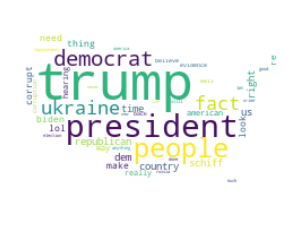
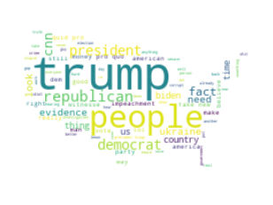
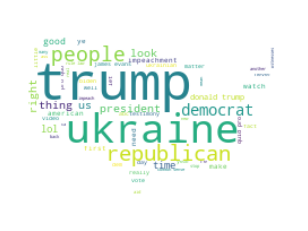
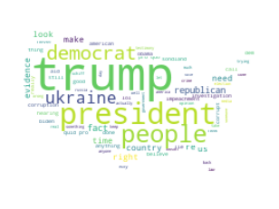
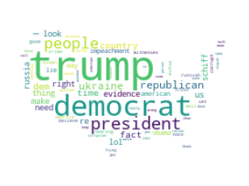
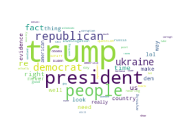

# Natural Language Processing- Fall 2019

Analyse the comments by YouTubers on Donald Trump Impeachment hearing videos. The same videos were uploaded by different channels. For this project, Fox News, CNN, ABC, CBS, NBC, and CSPAN were covered. The main idea of the project is to compare the difference between viewers of a channel by analysing the words they use while commenting on videos covering similar content.

In order to ensure that the comments represent the opinion of the viewer and not the opinion expressed in the video, no opinion pieces were covered. The videos were live telecasting/ late telecasting of the hearing proceedings. 


```python
#_______IMPORT PACKAGES_________#
from sklearn.feature_extraction.text import TfidfVectorizer
from wordcloud import WordCloud, ImageColorGenerator
from fuzzywuzzy import (fuzz, process)
from textatistic import Textatistic
from nltk.corpus import stopwords
import matplotlib.pyplot as plt
from string import punctuation
from nltk import word_tokenize
from PIL import Image
import pandas as pd
import numpy as np
import spacy
import os
```

## Data Collection

The data was collected through an R package and stored as CSV files.


```python
#_______IMPORTING THE DATASET (CSV FILES)_________#
#Set this path to the folder which contains the csv files
path = "/Users/rashmigupta/Documents/QMSS/QMSS Fall/NLP/Final Project/csv"
os.chdir(path)

#This function reads in the comments csv, extracts comments column and joins them into a single file.
def read_csv(file):
    #Read the csv file
    df_csv = pd.read_csv(file)
    #extract the comment column
    comments_df = df_csv[['Comment']]
    #Flatten the data frame
    comments = comments_df.values.flatten()
    #Join all the comments with a space in between. Becomes a list
    comments_list = " ". join(comments)
    return comments_list

#Reading each csv file one by one and storing the comments extracted in a variable
fox_comments = read_csv('FoxNews.csv')
cnn_comments = read_csv('CNN.csv')
abc_comments = read_csv('ABC.csv')
cbs_comments = read_csv('CBS.csv')
nbc_comments = read_csv('NBC.csv')
cspan_comments = read_csv('CSPAN.csv')

#Check the length of each of them
print(len(fox_comments), #907202
len(cnn_comments), #660724
len(abc_comments), #100204
len(cbs_comments), #558904
len(nbc_comments), #476359
len(cspan_comments)) #1491606
```

    907202 660724 100204 558904 476359 1491606


ABC has the least number of words because ABC had only 3 videos which were relevant to the analysis.
Fox News, CBS and NBC had 5 videos, CSPAN had 7 and CNN had 10 videos.
You can read more about the reason behind these numbers in the project presentation.

## Data Preprocessing

This step includes removing the stop words- words that do not add much meaning to the analysis like the, a, an, this, etc.
After preliminary examination of the comments some more words were added to the stop words list like think, know, would, said, etc. You can see the complete list in the code below.

The cleaned data is appended in a new dictionary, where the key is the channel name and value is cleaned comments.


```python
#Initialize a dictionary with keys as channel names and comments scraped as values
comments_dict = {'FoxNews':fox_comments,
                 'CNN':cnn_comments,
                 'ABC':abc_comments,
                 'CBS':cbs_comments,
                 'NBC':nbc_comments,
                 'CSPAN':cspan_comments}

#_______CLEANUP_________#
#put the comments of each channel into a new list comments
comments = list(comments_dict.values())
len(comments) #6
#Stopwords
stop_words = stopwords.words('english') + list(punctuation)
#removing some other commonly occuring words that seem useless to our analysis. This was done
#retrospectively after looking at the most commonly ocurring words that seemed meaningless as such.
#This list can be added or removed from as per your analysis needs.
remove_words = ['re', "n't",'think', 'com', 'got', 'say', 'going', 'go', 'know', 'get', 'would', 'said', 'one', 'like', 'see', 'even', 'want', 'https', 'nothing']
#A new comments list to store the cleaned comments.
clean_comments = []
#This loop will run 6 times, once for each channel
for x in comments:
    #This will return a tokenized copy of the text
    x = word_tokenize(x)
    #converting all the words in lower case
    x = [w.lower() for w in x]
    #removing stop words
    x = [w for w in x if w not in stop_words]
    #remove words in remove_words list
    x = [w for w in x if w not in remove_words]
    #removing digits from our comments
    x = [w for w in x if w.isdigit() == 0]
    clean_comments.append(x)
```

Here we can see every 300th word in the first cleaned comment stored in the clean_comments.


```python
temp = []
[temp.append(i) for i in clean_comments[0]]
print(temp[0::300])
```

    ['six', 'break', 'outlet', '1000,000', 'mr', 'work', 'security', 'saying', 'victim', 'today', 'alex', 'never', 'loud', 'misdemeanor', 'error', 'dog', 'pencil', 'case', 'presidents', 'quo', 'duties', 'clearly', 'candidate', 'hard', 'russia', 'failed', 'apologize', 'demonazi', 'never', 'could', 'evidence', 'state', 'taxpayers', 'received', 'hard', '...', 'quickly', 'waste', 'embarrassing', 'speech', 'honestly', 'eric', 'futures', "''", 'lol', 'system', 'degrades', 'third', 'trump', 'eyes', 'section', 'help', 'na', 'mueller', 'ignore', 'roberts', 'feeling', 'trump', 'warren', 'done', 'press', 'spaces', 'started', 'taxing', 'kent', 'ahh', 'though', 'already', 'uninterrupted', 'person', 'well', 'em', 'lil', 'pro', 'prosecuted', 'allow', 'collegues', 'cry', 'automatically', 'video', 'trump', 'proven', 'oath', 'yovanovitch', 'understand', 'fox', 'trump', 'sad', 'cancel', 'lock', 'mid-terms', 'personnel', 'minds', "'ll", 'back', 'country', 'shift', 'trump', 'trump', "''", 'fired', 'literally', 'wall', 'trump', 'different', 'way', 'administration', 'knew', 'president', 'live', 'individual', 'sister', 'draining', 'answered', 'trumps', '...', 'associate', 'bitches', 'really', '...', 'passing', 'coincides', 'due', 'trump', 'constituition', 'new', 'constitution', 'funny', 'steph', 'engaged', 'z', 'back', "'s", 'republicans', 'despite', "'s", 'seem', "''", 'draining', 'intimidation', 'lied', 'arrival', 'milton', 'thug', 'done', 'real', 'way', 'former', 'regrets', 'crimes', 'needed', 'must', 'ca', 'interests', 'tax', 'russia', 'hero', 'eight', '🇬🇧🤝🇺🇸', 'dismissed', 'corrupt', 'election', 'squandered', 'listening', 'squandered', 'finally', 'trump', 'turns', 'landslide', 'negative', '``', 'fbi', 'former', '``', 'false', 'sooner', 'back', 'pro', 'happened', 'named', 'kenneth', 'lies', 'little', 'vindman', 'sick', 'starts', 'waste', 'bad', 'na', 'rightfully', 'seen', 'snippets', 'advantage', 'trump', 'without', 'opinions', 'trump', 'american', 'quid', 'quid', 'proprieties', 'joe', 'orange', '``', 'could', 'things', 'republicans', 'mr', 'dems', 'jack', 'looney', 'schiff', 'country', 'indisputable', 'people', 'please', 'pivotal', 'trumps', 'jailed', 'troglodyte', "''", 'facts', 'opustes', 'funny.good', 'entering', 'moved', 'another', 'sounded', '``', 'fire', 'avoid', 'passed', 'corrupt', 'e', 'bragging', 'whale', 'ice', 'immune', 'clinton', 'congress', 'still', 'store', 'soon', 'fraudulent', 'minds', "'ve", 'facts', 'damning', 'question', 'comply', 'trump', 'question', "'re", 'partisanship', 'irrelevant', 'heros', 'interfere', 'trouble', 'states', 'republicans', 'testify', 'accusations', 'believes', 'support', 'misdeeds', 'direct', 'schiff', 'memory', 'cincy', 'ignorance', 'spelled', 'clyde', 'told', 'lying', 'enjoy', 'hope']


## Natural Language Processing
### TFIDF
I created a Term Frequency-Inverse Document Frequency matrix for the words in clean comments.

TFIDF helps in analysing words that are standing apart and are important in each of the documents. Here each channel is treated as a different document.


```python
#_______TFIDF_________#
#making a list of the channel names collecting the names from comments_dict dictionary keys
channels = list(comments_dict.keys())
#clean comments now stored with each variable which is the channel name.
#FOXNEWS is now a variable that stores the cleaned comments from FoxNews channel.
FOXNEWS, CNN, ABC, CBS, NBC, CSPAN = [y for y in clean_comments]

#checking the length of the cleaned comments. 
#This length might vary depending on the words that you have removed for cleaning in the remove_words list.
print(len(FOXNEWS), 
len(CNN),
len(ABC),
len(CBS), 
len(NBC), 
len(CSPAN)) 
# ABC has the least number of words

#defining a vectorizer with ngram range from 1 to 3
vectorizer = TfidfVectorizer(ngram_range=(1, 3))
#making a list of the channel variables which store the cleaned comments
channels_list = [FOXNEWS, CNN, ABC, CBS, NBC, CSPAN]
#Transform the comments and apply the vectorizer
vectors = vectorizer.fit_transform([str(w) for w in channels_list])
#extract the feature names from the vectorizer
feature_names = vectorizer.get_feature_names()
#return a matrix of the vectors
dense = vectors.todense()
#make a list from the matrix
denselist = dense.tolist()

#making a data frame of the frequencies of the words for each channel comments
df = pd.DataFrame(denselist, columns=feature_names, index = channels)
#Transpose the dataframe
df_t = df.T
#select the 20 most frequently occuring words for each channel.
#[df_t.nlargest(20,col) for col in df_t.columns]
```

    82778 60730 8954 50499 43456 134798


### Analysis 1
The following tables show the top 20 words that are standing apart across different channel comments. You can also see the ratio of importance they have in other channels.

As you could have imagined the word Trump is the most frequent word across all the channels. However, there are slight differences when it comes to certain channels.

Also, one interesting observation was mention of the word James Evans in ABC comments. This word does not occur in any other channel comments. Going back to the data to see what was happening here I realised that James Evans was name of one commenter whose comment got a lot of replies and multiple other comments referred to his handle. This was the reason it became a frequent word in the analysis here.

This made me realise the importance of always going back to the data to validate the outputs.


```python
df_t.nlargest(20, 'FoxNews')
```


```python
df_t.nlargest(20, 'CNN')
```


<div>
<style scoped>
    .dataframe tbody tr th:only-of-type {
        vertical-align: middle;
    }

    .dataframe tbody tr th {
        vertical-align: top;
    }

    .dataframe thead th {
        text-align: right;
    }
</style>
<table border="1" class="dataframe">
  <thead>
    <tr style="text-align: right;">
      <th></th>
      <th>FoxNews</th>
      <th>CNN</th>
      <th>ABC</th>
      <th>CBS</th>
      <th>NBC</th>
      <th>CSPAN</th>
    </tr>
  </thead>
  <tbody>
    <tr>
      <th>trump</th>
      <td>0.583787</td>
      <td>0.532570</td>
      <td>0.283477</td>
      <td>0.513399</td>
      <td>0.524715</td>
      <td>0.475529</td>
    </tr>
    <tr>
      <th>president</th>
      <td>0.234532</td>
      <td>0.208467</td>
      <td>0.193546</td>
      <td>0.265996</td>
      <td>0.212543</td>
      <td>0.254121</td>
    </tr>
    <tr>
      <th>cnn</th>
      <td>0.016207</td>
      <td>0.171655</td>
      <td>0.011730</td>
      <td>0.021693</td>
      <td>0.016907</td>
      <td>0.009966</td>
    </tr>
    <tr>
      <th>people</th>
      <td>0.184002</td>
      <td>0.156450</td>
      <td>0.144671</td>
      <td>0.175609</td>
      <td>0.149746</td>
      <td>0.182413</td>
    </tr>
    <tr>
      <th>ukraine</th>
      <td>0.121397</td>
      <td>0.108435</td>
      <td>0.113391</td>
      <td>0.113630</td>
      <td>0.109291</td>
      <td>0.150566</td>
    </tr>
    <tr>
      <th>biden</th>
      <td>0.088347</td>
      <td>0.106034</td>
      <td>0.039100</td>
      <td>0.100717</td>
      <td>0.076685</td>
      <td>0.109188</td>
    </tr>
    <tr>
      <th>impeachment</th>
      <td>0.069915</td>
      <td>0.102433</td>
      <td>0.056695</td>
      <td>0.084189</td>
      <td>0.088157</td>
      <td>0.067809</td>
    </tr>
    <tr>
      <th>evidence</th>
      <td>0.061334</td>
      <td>0.099632</td>
      <td>0.023460</td>
      <td>0.077991</td>
      <td>0.067023</td>
      <td>0.068459</td>
    </tr>
    <tr>
      <th>news</th>
      <td>0.066419</td>
      <td>0.096831</td>
      <td>0.064515</td>
      <td>0.085222</td>
      <td>0.056759</td>
      <td>0.037046</td>
    </tr>
    <tr>
      <th>democrats</th>
      <td>0.107096</td>
      <td>0.096431</td>
      <td>0.060605</td>
      <td>0.116212</td>
      <td>0.126197</td>
      <td>0.109188</td>
    </tr>
    <tr>
      <th>republicans</th>
      <td>0.070550</td>
      <td>0.086428</td>
      <td>0.078201</td>
      <td>0.072310</td>
      <td>0.081515</td>
      <td>0.102905</td>
    </tr>
    <tr>
      <th>time</th>
      <td>0.089618</td>
      <td>0.079625</td>
      <td>0.050830</td>
      <td>0.084706</td>
      <td>0.082723</td>
      <td>0.097056</td>
    </tr>
    <tr>
      <th>party</th>
      <td>0.040678</td>
      <td>0.076825</td>
      <td>0.037145</td>
      <td>0.032539</td>
      <td>0.042871</td>
      <td>0.046795</td>
    </tr>
    <tr>
      <th>us</th>
      <td>0.084215</td>
      <td>0.076424</td>
      <td>0.066470</td>
      <td>0.084706</td>
      <td>0.085138</td>
      <td>0.082541</td>
    </tr>
    <tr>
      <th>hurd</th>
      <td>0.000000</td>
      <td>0.073013</td>
      <td>0.000000</td>
      <td>0.000806</td>
      <td>0.000000</td>
      <td>0.005068</td>
    </tr>
    <tr>
      <th>impeach</th>
      <td>0.033686</td>
      <td>0.068822</td>
      <td>0.029325</td>
      <td>0.042869</td>
      <td>0.054947</td>
      <td>0.028380</td>
    </tr>
    <tr>
      <th>country</th>
      <td>0.088029</td>
      <td>0.067622</td>
      <td>0.066470</td>
      <td>0.084189</td>
      <td>0.086949</td>
      <td>0.087740</td>
    </tr>
    <tr>
      <th>lol</th>
      <td>0.059427</td>
      <td>0.067622</td>
      <td>0.056695</td>
      <td>0.058364</td>
      <td>0.061589</td>
      <td>0.060660</td>
    </tr>
    <tr>
      <th>facts</th>
      <td>0.056567</td>
      <td>0.066021</td>
      <td>0.025415</td>
      <td>0.050100</td>
      <td>0.050117</td>
      <td>0.051344</td>
    </tr>
    <tr>
      <th>fake</th>
      <td>0.029237</td>
      <td>0.064821</td>
      <td>0.021505</td>
      <td>0.040287</td>
      <td>0.033814</td>
      <td>0.014732</td>
    </tr>
  </tbody>
</table>
</div>


```python
df_t.nlargest(20, 'ABC')
```


<div>
<style scoped>
    .dataframe tbody tr th:only-of-type {
        vertical-align: middle;
    }

    .dataframe tbody tr th {
        vertical-align: top;
    }

    .dataframe thead th {
        text-align: right;
    }
</style>
<table border="1" class="dataframe">
  <thead>
    <tr style="text-align: right;">
      <th></th>
      <th>FoxNews</th>
      <th>CNN</th>
      <th>ABC</th>
      <th>CBS</th>
      <th>NBC</th>
      <th>CSPAN</th>
    </tr>
  </thead>
  <tbody>
    <tr>
      <th>trump</th>
      <td>0.583787</td>
      <td>0.532570</td>
      <td>0.283477</td>
      <td>0.513399</td>
      <td>0.524715</td>
      <td>0.475529</td>
    </tr>
    <tr>
      <th>president</th>
      <td>0.234532</td>
      <td>0.208467</td>
      <td>0.193546</td>
      <td>0.265996</td>
      <td>0.212543</td>
      <td>0.254121</td>
    </tr>
    <tr>
      <th>people</th>
      <td>0.184002</td>
      <td>0.156450</td>
      <td>0.144671</td>
      <td>0.175609</td>
      <td>0.149746</td>
      <td>0.182413</td>
    </tr>
    <tr>
      <th>ukraine</th>
      <td>0.121397</td>
      <td>0.108435</td>
      <td>0.113391</td>
      <td>0.113630</td>
      <td>0.109291</td>
      <td>0.150566</td>
    </tr>
    <tr>
      <th>james evans</th>
      <td>0.000000</td>
      <td>0.000000</td>
      <td>0.083679</td>
      <td>0.000000</td>
      <td>0.000000</td>
      <td>0.000000</td>
    </tr>
    <tr>
      <th>republicans</th>
      <td>0.070550</td>
      <td>0.086428</td>
      <td>0.078201</td>
      <td>0.072310</td>
      <td>0.081515</td>
      <td>0.102905</td>
    </tr>
    <tr>
      <th>american</th>
      <td>0.063876</td>
      <td>0.046415</td>
      <td>0.070380</td>
      <td>0.056815</td>
      <td>0.064608</td>
      <td>0.054377</td>
    </tr>
    <tr>
      <th>country</th>
      <td>0.088029</td>
      <td>0.067622</td>
      <td>0.066470</td>
      <td>0.084189</td>
      <td>0.086949</td>
      <td>0.087740</td>
    </tr>
    <tr>
      <th>us</th>
      <td>0.084215</td>
      <td>0.076424</td>
      <td>0.066470</td>
      <td>0.084706</td>
      <td>0.085138</td>
      <td>0.082541</td>
    </tr>
    <tr>
      <th>com</th>
      <td>0.000000</td>
      <td>0.039254</td>
      <td>0.065435</td>
      <td>0.017883</td>
      <td>0.050873</td>
      <td>0.087263</td>
    </tr>
    <tr>
      <th>news</th>
      <td>0.066419</td>
      <td>0.096831</td>
      <td>0.064515</td>
      <td>0.085222</td>
      <td>0.056759</td>
      <td>0.037046</td>
    </tr>
    <tr>
      <th>plain common</th>
      <td>0.000000</td>
      <td>0.000000</td>
      <td>0.061659</td>
      <td>0.000000</td>
      <td>0.000000</td>
      <td>0.000000</td>
    </tr>
    <tr>
      <th>plain common sense</th>
      <td>0.000000</td>
      <td>0.000000</td>
      <td>0.061659</td>
      <td>0.000000</td>
      <td>0.000000</td>
      <td>0.000000</td>
    </tr>
    <tr>
      <th>democrats</th>
      <td>0.107096</td>
      <td>0.096431</td>
      <td>0.060605</td>
      <td>0.116212</td>
      <td>0.126197</td>
      <td>0.109188</td>
    </tr>
    <tr>
      <th>right</th>
      <td>0.079766</td>
      <td>0.062420</td>
      <td>0.058650</td>
      <td>0.074892</td>
      <td>0.078496</td>
      <td>0.085574</td>
    </tr>
    <tr>
      <th>evans</th>
      <td>0.000000</td>
      <td>0.000624</td>
      <td>0.057932</td>
      <td>0.000000</td>
      <td>0.000000</td>
      <td>0.000676</td>
    </tr>
    <tr>
      <th>impeachment</th>
      <td>0.069915</td>
      <td>0.102433</td>
      <td>0.056695</td>
      <td>0.084189</td>
      <td>0.088157</td>
      <td>0.067809</td>
    </tr>
    <tr>
      <th>lol</th>
      <td>0.059427</td>
      <td>0.067622</td>
      <td>0.056695</td>
      <td>0.058364</td>
      <td>0.061589</td>
      <td>0.060660</td>
    </tr>
    <tr>
      <th>look</th>
      <td>0.048940</td>
      <td>0.052817</td>
      <td>0.056695</td>
      <td>0.056815</td>
      <td>0.050117</td>
      <td>0.055894</td>
    </tr>
    <tr>
      <th>man</th>
      <td>0.042902</td>
      <td>0.043614</td>
      <td>0.056695</td>
      <td>0.039770</td>
      <td>0.062193</td>
      <td>0.045278</td>
    </tr>
  </tbody>
</table>
</div>


```python
df_t.nlargest(20, 'CBS')
```


<div>
<style scoped>
    .dataframe tbody tr th:only-of-type {
        vertical-align: middle;
    }

    .dataframe tbody tr th {
        vertical-align: top;
    }

    .dataframe thead th {
        text-align: right;
    }
</style>
<table border="1" class="dataframe">
  <thead>
    <tr style="text-align: right;">
      <th></th>
      <th>FoxNews</th>
      <th>CNN</th>
      <th>ABC</th>
      <th>CBS</th>
      <th>NBC</th>
      <th>CSPAN</th>
    </tr>
  </thead>
  <tbody>
    <tr>
      <th>trump</th>
      <td>0.583787</td>
      <td>0.532570</td>
      <td>0.283477</td>
      <td>0.513399</td>
      <td>0.524715</td>
      <td>0.475529</td>
    </tr>
    <tr>
      <th>president</th>
      <td>0.234532</td>
      <td>0.208467</td>
      <td>0.193546</td>
      <td>0.265996</td>
      <td>0.212543</td>
      <td>0.254121</td>
    </tr>
    <tr>
      <th>people</th>
      <td>0.184002</td>
      <td>0.156450</td>
      <td>0.144671</td>
      <td>0.175609</td>
      <td>0.149746</td>
      <td>0.182413</td>
    </tr>
    <tr>
      <th>democrats</th>
      <td>0.107096</td>
      <td>0.096431</td>
      <td>0.060605</td>
      <td>0.116212</td>
      <td>0.126197</td>
      <td>0.109188</td>
    </tr>
    <tr>
      <th>ukraine</th>
      <td>0.121397</td>
      <td>0.108435</td>
      <td>0.113391</td>
      <td>0.113630</td>
      <td>0.109291</td>
      <td>0.150566</td>
    </tr>
    <tr>
      <th>biden</th>
      <td>0.088347</td>
      <td>0.106034</td>
      <td>0.039100</td>
      <td>0.100717</td>
      <td>0.076685</td>
      <td>0.109188</td>
    </tr>
    <tr>
      <th>news</th>
      <td>0.066419</td>
      <td>0.096831</td>
      <td>0.064515</td>
      <td>0.085222</td>
      <td>0.056759</td>
      <td>0.037046</td>
    </tr>
    <tr>
      <th>re</th>
      <td>0.068643</td>
      <td>0.055618</td>
      <td>0.046920</td>
      <td>0.085222</td>
      <td>0.073665</td>
      <td>0.097056</td>
    </tr>
    <tr>
      <th>time</th>
      <td>0.089618</td>
      <td>0.079625</td>
      <td>0.050830</td>
      <td>0.084706</td>
      <td>0.082723</td>
      <td>0.097056</td>
    </tr>
    <tr>
      <th>us</th>
      <td>0.084215</td>
      <td>0.076424</td>
      <td>0.066470</td>
      <td>0.084706</td>
      <td>0.085138</td>
      <td>0.082541</td>
    </tr>
    <tr>
      <th>country</th>
      <td>0.088029</td>
      <td>0.067622</td>
      <td>0.066470</td>
      <td>0.084189</td>
      <td>0.086949</td>
      <td>0.087740</td>
    </tr>
    <tr>
      <th>impeachment</th>
      <td>0.069915</td>
      <td>0.102433</td>
      <td>0.056695</td>
      <td>0.084189</td>
      <td>0.088157</td>
      <td>0.067809</td>
    </tr>
    <tr>
      <th>evidence</th>
      <td>0.061334</td>
      <td>0.099632</td>
      <td>0.023460</td>
      <td>0.077991</td>
      <td>0.067023</td>
      <td>0.068459</td>
    </tr>
    <tr>
      <th>right</th>
      <td>0.079766</td>
      <td>0.062420</td>
      <td>0.058650</td>
      <td>0.074892</td>
      <td>0.078496</td>
      <td>0.085574</td>
    </tr>
    <tr>
      <th>republicans</th>
      <td>0.070550</td>
      <td>0.086428</td>
      <td>0.078201</td>
      <td>0.072310</td>
      <td>0.081515</td>
      <td>0.102905</td>
    </tr>
    <tr>
      <th>call</th>
      <td>0.059427</td>
      <td>0.058019</td>
      <td>0.021505</td>
      <td>0.071793</td>
      <td>0.045286</td>
      <td>0.062610</td>
    </tr>
    <tr>
      <th>corruption</th>
      <td>0.068326</td>
      <td>0.039613</td>
      <td>0.023460</td>
      <td>0.071277</td>
      <td>0.047098</td>
      <td>0.060443</td>
    </tr>
    <tr>
      <th>aid</th>
      <td>0.043538</td>
      <td>0.048415</td>
      <td>0.027370</td>
      <td>0.070244</td>
      <td>0.034417</td>
      <td>0.065859</td>
    </tr>
    <tr>
      <th>make</th>
      <td>0.057521</td>
      <td>0.047215</td>
      <td>0.031280</td>
      <td>0.070244</td>
      <td>0.056155</td>
      <td>0.060443</td>
    </tr>
    <tr>
      <th>pro</th>
      <td>0.041949</td>
      <td>0.062820</td>
      <td>0.039100</td>
      <td>0.064046</td>
      <td>0.028983</td>
      <td>0.040079</td>
    </tr>
  </tbody>
</table>
</div>


```python
df_t.nlargest(20, 'NBC')
```


<div>
<style scoped>
    .dataframe tbody tr th:only-of-type {
        vertical-align: middle;
    }

    .dataframe tbody tr th {
        vertical-align: top;
    }

    .dataframe thead th {
        text-align: right;
    }
</style>
<table border="1" class="dataframe">
  <thead>
    <tr style="text-align: right;">
      <th></th>
      <th>FoxNews</th>
      <th>CNN</th>
      <th>ABC</th>
      <th>CBS</th>
      <th>NBC</th>
      <th>CSPAN</th>
    </tr>
  </thead>
  <tbody>
    <tr>
      <th>trump</th>
      <td>0.583787</td>
      <td>0.532570</td>
      <td>0.283477</td>
      <td>0.513399</td>
      <td>0.524715</td>
      <td>0.475529</td>
    </tr>
    <tr>
      <th>president</th>
      <td>0.234532</td>
      <td>0.208467</td>
      <td>0.193546</td>
      <td>0.265996</td>
      <td>0.212543</td>
      <td>0.254121</td>
    </tr>
    <tr>
      <th>people</th>
      <td>0.184002</td>
      <td>0.156450</td>
      <td>0.144671</td>
      <td>0.175609</td>
      <td>0.149746</td>
      <td>0.182413</td>
    </tr>
    <tr>
      <th>democrats</th>
      <td>0.107096</td>
      <td>0.096431</td>
      <td>0.060605</td>
      <td>0.116212</td>
      <td>0.126197</td>
      <td>0.109188</td>
    </tr>
    <tr>
      <th>ukraine</th>
      <td>0.121397</td>
      <td>0.108435</td>
      <td>0.113391</td>
      <td>0.113630</td>
      <td>0.109291</td>
      <td>0.150566</td>
    </tr>
    <tr>
      <th>schiff</th>
      <td>0.124257</td>
      <td>0.049616</td>
      <td>0.033235</td>
      <td>0.052683</td>
      <td>0.091176</td>
      <td>0.083191</td>
    </tr>
    <tr>
      <th>impeachment</th>
      <td>0.069915</td>
      <td>0.102433</td>
      <td>0.056695</td>
      <td>0.084189</td>
      <td>0.088157</td>
      <td>0.067809</td>
    </tr>
    <tr>
      <th>country</th>
      <td>0.088029</td>
      <td>0.067622</td>
      <td>0.066470</td>
      <td>0.084189</td>
      <td>0.086949</td>
      <td>0.087740</td>
    </tr>
    <tr>
      <th>us</th>
      <td>0.084215</td>
      <td>0.076424</td>
      <td>0.066470</td>
      <td>0.084706</td>
      <td>0.085138</td>
      <td>0.082541</td>
    </tr>
    <tr>
      <th>time</th>
      <td>0.089618</td>
      <td>0.079625</td>
      <td>0.050830</td>
      <td>0.084706</td>
      <td>0.082723</td>
      <td>0.097056</td>
    </tr>
    <tr>
      <th>republicans</th>
      <td>0.070550</td>
      <td>0.086428</td>
      <td>0.078201</td>
      <td>0.072310</td>
      <td>0.081515</td>
      <td>0.102905</td>
    </tr>
    <tr>
      <th>right</th>
      <td>0.079766</td>
      <td>0.062420</td>
      <td>0.058650</td>
      <td>0.074892</td>
      <td>0.078496</td>
      <td>0.085574</td>
    </tr>
    <tr>
      <th>biden</th>
      <td>0.088347</td>
      <td>0.106034</td>
      <td>0.039100</td>
      <td>0.100717</td>
      <td>0.076685</td>
      <td>0.109188</td>
    </tr>
    <tr>
      <th>dems</th>
      <td>0.067690</td>
      <td>0.046415</td>
      <td>0.029325</td>
      <td>0.052166</td>
      <td>0.074873</td>
      <td>0.048528</td>
    </tr>
    <tr>
      <th>re</th>
      <td>0.068643</td>
      <td>0.055618</td>
      <td>0.046920</td>
      <td>0.085222</td>
      <td>0.073665</td>
      <td>0.097056</td>
    </tr>
    <tr>
      <th>evidence</th>
      <td>0.061334</td>
      <td>0.099632</td>
      <td>0.023460</td>
      <td>0.077991</td>
      <td>0.067023</td>
      <td>0.068459</td>
    </tr>
    <tr>
      <th>american</th>
      <td>0.063876</td>
      <td>0.046415</td>
      <td>0.070380</td>
      <td>0.056815</td>
      <td>0.064608</td>
      <td>0.054377</td>
    </tr>
    <tr>
      <th>russia</th>
      <td>0.049576</td>
      <td>0.037612</td>
      <td>0.031280</td>
      <td>0.046485</td>
      <td>0.064004</td>
      <td>0.051994</td>
    </tr>
    <tr>
      <th>man</th>
      <td>0.042902</td>
      <td>0.043614</td>
      <td>0.056695</td>
      <td>0.039770</td>
      <td>0.062193</td>
      <td>0.045278</td>
    </tr>
    <tr>
      <th>lol</th>
      <td>0.059427</td>
      <td>0.067622</td>
      <td>0.056695</td>
      <td>0.058364</td>
      <td>0.061589</td>
      <td>0.060660</td>
    </tr>
  </tbody>
</table>
</div>


```python
df_t.nlargest(20, 'CSPAN')
```


<div>
<style scoped>
    .dataframe tbody tr th:only-of-type {
        vertical-align: middle;
    }

    .dataframe tbody tr th {
        vertical-align: top;
    }

    .dataframe thead th {
        text-align: right;
    }
</style>
<table border="1" class="dataframe">
  <thead>
    <tr style="text-align: right;">
      <th></th>
      <th>FoxNews</th>
      <th>CNN</th>
      <th>ABC</th>
      <th>CBS</th>
      <th>NBC</th>
      <th>CSPAN</th>
    </tr>
  </thead>
  <tbody>
    <tr>
      <th>trump</th>
      <td>0.583787</td>
      <td>0.532570</td>
      <td>0.283477</td>
      <td>0.513399</td>
      <td>0.524715</td>
      <td>0.475529</td>
    </tr>
    <tr>
      <th>president</th>
      <td>0.234532</td>
      <td>0.208467</td>
      <td>0.193546</td>
      <td>0.265996</td>
      <td>0.212543</td>
      <td>0.254121</td>
    </tr>
    <tr>
      <th>people</th>
      <td>0.184002</td>
      <td>0.156450</td>
      <td>0.144671</td>
      <td>0.175609</td>
      <td>0.149746</td>
      <td>0.182413</td>
    </tr>
    <tr>
      <th>ukraine</th>
      <td>0.121397</td>
      <td>0.108435</td>
      <td>0.113391</td>
      <td>0.113630</td>
      <td>0.109291</td>
      <td>0.150566</td>
    </tr>
    <tr>
      <th>biden</th>
      <td>0.088347</td>
      <td>0.106034</td>
      <td>0.039100</td>
      <td>0.100717</td>
      <td>0.076685</td>
      <td>0.109188</td>
    </tr>
    <tr>
      <th>democrats</th>
      <td>0.107096</td>
      <td>0.096431</td>
      <td>0.060605</td>
      <td>0.116212</td>
      <td>0.126197</td>
      <td>0.109188</td>
    </tr>
    <tr>
      <th>republicans</th>
      <td>0.070550</td>
      <td>0.086428</td>
      <td>0.078201</td>
      <td>0.072310</td>
      <td>0.081515</td>
      <td>0.102905</td>
    </tr>
    <tr>
      <th>re</th>
      <td>0.068643</td>
      <td>0.055618</td>
      <td>0.046920</td>
      <td>0.085222</td>
      <td>0.073665</td>
      <td>0.097056</td>
    </tr>
    <tr>
      <th>time</th>
      <td>0.089618</td>
      <td>0.079625</td>
      <td>0.050830</td>
      <td>0.084706</td>
      <td>0.082723</td>
      <td>0.097056</td>
    </tr>
    <tr>
      <th>country</th>
      <td>0.088029</td>
      <td>0.067622</td>
      <td>0.066470</td>
      <td>0.084189</td>
      <td>0.086949</td>
      <td>0.087740</td>
    </tr>
    <tr>
      <th>com</th>
      <td>0.000000</td>
      <td>0.039254</td>
      <td>0.065435</td>
      <td>0.017883</td>
      <td>0.050873</td>
      <td>0.087263</td>
    </tr>
    <tr>
      <th>right</th>
      <td>0.079766</td>
      <td>0.062420</td>
      <td>0.058650</td>
      <td>0.074892</td>
      <td>0.078496</td>
      <td>0.085574</td>
    </tr>
    <tr>
      <th>schiff</th>
      <td>0.124257</td>
      <td>0.049616</td>
      <td>0.033235</td>
      <td>0.052683</td>
      <td>0.091176</td>
      <td>0.083191</td>
    </tr>
    <tr>
      <th>us</th>
      <td>0.084215</td>
      <td>0.076424</td>
      <td>0.066470</td>
      <td>0.084706</td>
      <td>0.085138</td>
      <td>0.082541</td>
    </tr>
    <tr>
      <th>watch</th>
      <td>0.043538</td>
      <td>0.051616</td>
      <td>0.044965</td>
      <td>0.033056</td>
      <td>0.057966</td>
      <td>0.080807</td>
    </tr>
    <tr>
      <th>www</th>
      <td>0.000000</td>
      <td>0.030479</td>
      <td>0.047384</td>
      <td>0.014903</td>
      <td>0.041117</td>
      <td>0.070261</td>
    </tr>
    <tr>
      <th>evidence</th>
      <td>0.061334</td>
      <td>0.099632</td>
      <td>0.023460</td>
      <td>0.077991</td>
      <td>0.067023</td>
      <td>0.068459</td>
    </tr>
    <tr>
      <th>youtu</th>
      <td>0.000000</td>
      <td>0.030018</td>
      <td>0.036102</td>
      <td>0.017287</td>
      <td>0.013241</td>
      <td>0.068010</td>
    </tr>
    <tr>
      <th>youtu be</th>
      <td>0.000000</td>
      <td>0.030018</td>
      <td>0.036102</td>
      <td>0.017287</td>
      <td>0.013241</td>
      <td>0.068010</td>
    </tr>
    <tr>
      <th>impeachment</th>
      <td>0.069915</td>
      <td>0.102433</td>
      <td>0.056695</td>
      <td>0.084189</td>
      <td>0.088157</td>
      <td>0.067809</td>
    </tr>
  </tbody>
</table>
</div>


### Analysis 2

Hand picking a few interesting terms here to see how they appear across different channels.


```python
#_______Looking for some interesting terms now_________#
terms = ['democrats', 'trump', 'impeachment', 'biden', 'hunter']
df_t.loc[terms]
#Both Hunter and Biden appear more in CNN, CBS and CSPAN
```


<div>
<style scoped>
    .dataframe tbody tr th:only-of-type {
        vertical-align: middle;
    }

    .dataframe tbody tr th {
        vertical-align: top;
    }

    .dataframe thead th {
        text-align: right;
    }
</style>
<table border="1" class="dataframe">
  <thead>
    <tr style="text-align: right;">
      <th></th>
      <th>FoxNews</th>
      <th>CNN</th>
      <th>ABC</th>
      <th>CBS</th>
      <th>NBC</th>
      <th>CSPAN</th>
    </tr>
  </thead>
  <tbody>
    <tr>
      <th>democrats</th>
      <td>0.107096</td>
      <td>0.096431</td>
      <td>0.060605</td>
      <td>0.116212</td>
      <td>0.126197</td>
      <td>0.109188</td>
    </tr>
    <tr>
      <th>trump</th>
      <td>0.583787</td>
      <td>0.532570</td>
      <td>0.283477</td>
      <td>0.513399</td>
      <td>0.524715</td>
      <td>0.475529</td>
    </tr>
    <tr>
      <th>impeachment</th>
      <td>0.069915</td>
      <td>0.102433</td>
      <td>0.056695</td>
      <td>0.084189</td>
      <td>0.088157</td>
      <td>0.067809</td>
    </tr>
    <tr>
      <th>biden</th>
      <td>0.088347</td>
      <td>0.106034</td>
      <td>0.039100</td>
      <td>0.100717</td>
      <td>0.076685</td>
      <td>0.109188</td>
    </tr>
    <tr>
      <th>hunter</th>
      <td>0.013983</td>
      <td>0.028009</td>
      <td>0.021505</td>
      <td>0.023759</td>
      <td>0.018114</td>
      <td>0.030330</td>
    </tr>
  </tbody>
</table>
</div>


```python
terms = ['ukraine', 'yovanovitch', 'burisma', 'zelensky', 'guliani']
df_t.loc[terms]
```


<div>
<style scoped>
    .dataframe tbody tr th:only-of-type {
        vertical-align: middle;
    }

    .dataframe tbody tr th {
        vertical-align: top;
    }

    .dataframe thead th {
        text-align: right;
    }
</style>
<table border="1" class="dataframe">
  <thead>
    <tr style="text-align: right;">
      <th></th>
      <th>FoxNews</th>
      <th>CNN</th>
      <th>ABC</th>
      <th>CBS</th>
      <th>NBC</th>
      <th>CSPAN</th>
    </tr>
  </thead>
  <tbody>
    <tr>
      <th>ukraine</th>
      <td>0.121397</td>
      <td>0.108435</td>
      <td>0.113391</td>
      <td>0.113630</td>
      <td>0.109291</td>
      <td>0.150566</td>
    </tr>
    <tr>
      <th>yovanovitch</th>
      <td>0.022563</td>
      <td>0.002001</td>
      <td>0.009775</td>
      <td>0.002582</td>
      <td>0.007850</td>
      <td>0.016032</td>
    </tr>
    <tr>
      <th>burisma</th>
      <td>0.007945</td>
      <td>0.028409</td>
      <td>0.013685</td>
      <td>0.027374</td>
      <td>0.010265</td>
      <td>0.032713</td>
    </tr>
    <tr>
      <th>zelensky</th>
      <td>0.004035</td>
      <td>0.042025</td>
      <td>0.000000</td>
      <td>0.020268</td>
      <td>0.013241</td>
      <td>0.020003</td>
    </tr>
    <tr>
      <th>guliani</th>
      <td>0.001467</td>
      <td>0.000924</td>
      <td>0.004513</td>
      <td>0.000000</td>
      <td>0.001394</td>
      <td>0.000750</td>
    </tr>
  </tbody>
</table>
</div>


## Natural Language Processing
### Named Entity Recognition
Trying to capture what are some people, Organizations, Places mentioned in the comments.


```python
#_______NER_________#
#'en_core_web_sm' is spaCy's english language model. In this line I am loading it and naming the variable 'nlp'.
nlp = spacy.load('en_core_web_sm')
number = len(comments_dict.keys())
#creating dictionaries to store different types of entities for analysis later
uniq_ppl = {}
uniq_GPE = {}
uniq_NORP = {}
uniq_ORG = {}

#Loop will run 6 times, once for each channel
#In this I am extracting the names that have entities PERSON, GPE, NORP, ORG for each channel
for i in range(number):
    channel_name = list(comments_dict.keys())[i]
    #nlp worked only with 1000000 values at max
    text = nlp(list(comments_dict.values())[i][0:1000000])
    text_list = [(X.text, X.label_) for X in text.ents]
    text_ents = [x.label_ for x in text.ents]
    #append all with channel name
    people = []
    GPE = []
    NORP = []
    ORG = []
    for x in text_list:
        if x[1] == 'PERSON':
            people.append(x[0])
        if x[1] == 'GPE':
            GPE.append(x[0])
        if x[1] == 'NORP':
            NORP.append(x[0])
        if x[1] == 'ORG':
            ORG.append(x[0])
    #extracting distinct values
    uniq_ppl[i] = set(people)
    uniq_GPE[i] = set(GPE)
    uniq_NORP[i] = set(NORP)
    uniq_ORG[i] = set(ORG)  
```

### Analysis 3

Looking for some misnomers associated with words like Trump, Democrats, Republicans, etc. and also who is using these.

The code chunks below find strings that are similar to a given word in the various dictionaries. The function will give us top 20 matches.
scorer = fuzz.ratio will compare the entire strings with each other. And give us a list of strings in the order in which
they match the most to least. I am using this ratio because I want to match a given word completely with another string.


```python
similar_strings_trump = {}
for i in range(len(uniq_ppl.keys())):
    similar_strings_trump[i] = process.extract("Trump", list(uniq_ppl.values())[i], limit=20, scorer=fuzz.ratio)
similar_strings_trump
```


    {0: [('Trump  ', 100),
      ('Trump', 100),
      ('💖 Trump', 100),
      ('tRump👹', 100),
      ('TRUMP', 100),
      ('😊 Trump', 100),
      ('Trumps', 91),
      ('Trumpf', 91),
      ('Tump', 89),
      ('Trump’s', 83),
      ('Trump _', 83),
      ('Trunp', 80),
      ('Trump Jr.', 77),
      ('Mr Trump', 77),
      ('Trumpsky', 77),
      ('Trumpers', 77),
      ('Trump Sr', 77),
      ('Drumpf', 73),
      ('Truman', 73),
      ('Trump IMO', 71)],
     1: [('Trump "', 100),
      ('TRUMP  ', 100),
      ('Trump', 100),
      ('TRUMP', 100),
      ('Trump🇷', 100),
      ('Trump  ', 100),
      ('Trumps', 91),
      ('Trumpie', 83),
      ('Mr TRUMP', 77),
      ('DRUMPF', 73),
      ('Drumpf', 73),
      ('Lol Trump', 71),
      ('Trumpland', 71),
      ('Trump Said', 67),
      ('Term', 67),
      ('Trump 2020.', 67),
      ('Trump 2020', 67),
      ('Troll tRump', 62),
      ('Trump  2020', 62),
      ('Trump ASKED', 62)],
     2: [('Trump', 100),
      ('Trumpty', 83),
      ('Drumpf', 73),
      ('Help Trump', 67),
      ('True', 67),
      ('Trump WILL', 67),
      ('Donald Trump', 59),
      ('Umm', 50),
      ('Run', 50),
      ('Huma', 44),
      ('Rudy', 44),
      ('Impeach MoronTrump', 43),
      ('@Jason Donald Trump', 43),
      ('Tribes', 36),
      ('Retard', 36),
      ('Taylor', 36),
      ('Matter', 36),
      ('Hitler', 36),
      ('Hunter', 36),
      ('Burisma', 33)],
     3: [('tRump👹', 100),
      ('Trump 🇺', 100),
      ('Trump', 100),
      ('TRUMP', 100),
      ('Trumps', 91),
      ('Trumpf', 91),
      ('Trump Jr.', 77),
      ('DRUMPF', 73),
      ('Don Trump', 71),
      ('Lol Trump', 71),
      ('Trump 2020', 67),
      ('Trump Going', 62),
      ('Wenstrup', 62),
      ('😊 Donald Trump', 59),
      ('Trump within', 59),
      ('Donald Trump', 59),
      ('Impeach TRUMP', 56),
      ('Traitor Trump', 56),
      ('Impeach Trump', 56),
      ('Donald Trump’s', 53)],
     4: [('Trump', 100),
      ('tRump', 100),
      ('TRUMP', 100),
      ('@TRUMP', 100),
      ('Trump  ', 100),
      ('Trumps', 91),
      ('Trumpty', 83),
      ('Triumph', 83),
      ('Trumpers', 77),
      ('Mr Trump', 77),
      ('Trumpski', 77),
      ('Trump How', 71),
      ('Trumpturd', 71),
      ('Trump 2020 -', 67),
      ('Lock Trump', 67),
      ('Hive Trump', 67),
      ('Heil Trump', 67),
      ('Don Trumps', 67),
      ('Drumpfh', 67),
      ('Trump  - a', 67)],
     5: [('Trump  ', 100),
      ('Trump⚡', 100),
      ('Trump', 100),
      ('Trump   ', 100),
      ('TRUMP', 100),
      ('Trumps', 91),
      ('Trumper', 83),
      ('Trump’s', 83),
      ('Trump DO', 77),
      ('Trump Jr', 77),
      ('Drumpf', 73),
      ('Trump Omg', 71),
      ('Jew Trump', 71),
      ('JFK Trump', 71),
      ('Trump2020', 71),
      ('Trumptard', 71),
      ('Lol Trump', 71),
      ('Hope Trump', 67),
      ('Trump.they', 67),
      ('Trump 2020', 67)]}


```python
#Some funny words used for democrats
similar_strings_democrats = {}
for i in range(len(uniq_NORP.keys())):
    similar_strings_democrats[i] = process.extract("Democrats", list(uniq_NORP.values())[i], limit=20, scorer=fuzz.partial_ratio)
similar_strings_democrats
```


```python
#finding more similar words now wherever they have been categorized as ORG
similar_strings_democrats1 = {}
for i in range(len(uniq_NORP.keys())):
    similar_strings_democrats1[i] = process.extract("Democrats", list(uniq_ORG.values())[i], limit=20, scorer=fuzz.partial_ratio)
similar_strings_democrats1
```


```python
similar_strings_schiff = {}
for i in range(len(uniq_ppl.keys())):
    similar_strings_schiff[i] = process.extract("Schiff", list(uniq_ppl.values())[i], limit = 20, scorer = fuzz.partial_ratio)
similar_strings_schiff
```


```python
similar_strings_russia = {}
for i in range(len(uniq_ppl.keys())):
    similar_strings_russia[i] = process.extract("Russia", list(uniq_GPE.values())[i], limit = 20, scorer = fuzz.partial_ratio)
similar_strings_russia
```


```python
#Some funny words used for republicans
similar_strings_republicans = {}
for i in range(len(uniq_ppl.keys())):
    similar_strings_republicans[i] = process.extract("Republicans", list(uniq_NORP.values())[i], limit = 20, scorer = fuzz.partial_ratio)
similar_strings_republicans
```


```python
#finding more similar words now wherever they have been categorized as ORG
similar_strings_republicans1 = {}
for i in range(len(uniq_ppl.keys())):
    similar_strings_republicans1[i] = process.extract("Republicans", list(uniq_ORG.values())[i], limit = 20, scorer = fuzz.partial_ratio)
similar_strings_republicans1
```


```python
similar_strings_hill = {}
for i in range(len(uniq_ppl.keys())):
    similar_strings_hill[i] = process.extract("Hill", list(uniq_ppl.values())[i], limit = 20, scorer = fuzz.partial_ratio)
similar_strings_hill
```

## Natural Language Processing
### Readability Score

Let us also see what are the readability scores of the comments and if there is a pattern here according to different channels.


```python
#~~~~~~~~~~~~~~~~~~~~~ Readability Section ~~~~~~~~~~~~~~~~~~~~~~~~~~~#
    
#Defining a function which will return Flesch and smog score for the text
def givescore(text):
    t = Textatistic(text)
    flesch = t.flesch_score
    print(flesch)
    smog = t.smog_score
    print(smog)

for comment in list(comments_dict.values()):
    givescore(comment[0:10000])

```

## Visualization

No Natural Language Project would be complete without a word cloud.

This is just an interesting way to analyse some common words that occur in the comments according to the channels. In order to make it more interesting I over-lapped them with the map of US.

The images are saved in the visualisations folder in case you want to look at them closely.


```python
#~~~~~~~~~~~~~~~~~~~~~~~~WORD CLOUD~~~~~~~~~~~~~~~~~~~#
path = "/Users/rashmigupta/Desktop/NLP/Final Project/images"
os.chdir(path)
flag_mask = np.array(Image.open("s.png"))
flag_mask

def transform_format(val):
    if val == 0:
        return 255
    else:
        return val
    
# Transform your mask into a new one that will work with the function:
transformed_flag_mask = np.ndarray((flag_mask.shape[0],flag_mask.shape[1]), np.int32)

for i in range(len(flag_mask)):
    transformed_flag_mask[i] = list(map(transform_format, flag_mask[i]))

#transformed_flag_mask
image_colors = ImageColorGenerator(flag_mask)

def GenerateWordCloud(list, i):
    text = ' '.join(list)
    wordcloud = WordCloud(max_font_size=50, max_words=100, 
                          background_color="white", mask = transformed_flag_mask, mode = "RGB",
                         width = 64000, height = 32000).generate(text)
    plt.imshow(wordcloud, interpolation='bilinear')
    plt.axis("off")
    plt.show()
    filename = str(i)+"wordcloud.png"
    wordcloud.to_file(filename)
    

# Start with one review:
i = 0
for x in clean_comments:
    GenerateWordCloud(x, i)
    i = i + 1
```




















## Summary

There is quite some difference in the comments by different channels. I think the most interesting thing for me was to analyse the various misnomers that are used for Democrats or Republicans depending on what is the political leaning of the channel which uploaded the video.

Also, a few channel comments seem to have a more intelligent discussion around the video. I am drawing this inference on the basis of some words that occur which are more factual in nature and seem representative of a more nuanced discussion.

However, it seems that across all the channels covered here, comments section on YouTube is used more for name calling and posting derogatory remarks than for sharing an intelligent opinion about the content.


```python

```
